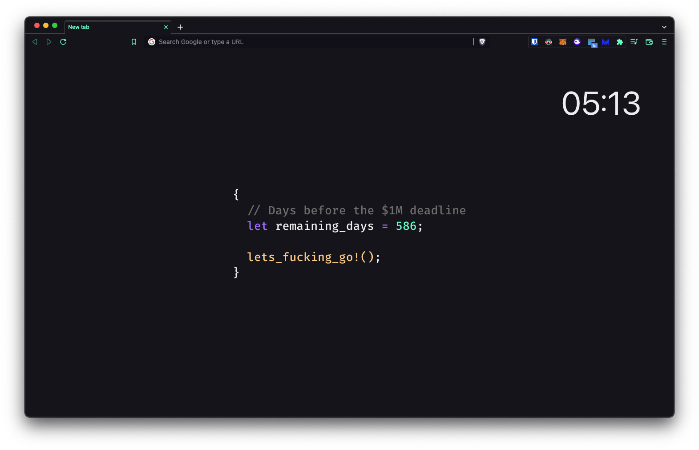

# New tab

Yet another tab chrome extension.

## About

The story behind this project is pretty simple;

> I want to see my main goal and the remaining days until the deadline as often as possible 🤣




## Available Scripts

```sh
npm run build # Compile the app for the production
npm run start # Launch dev server locally
```

## How is linked the React application and the Chrome extension?

The king piece is the [`manifest.json`](./public/manifest.json).

### Upload the app to your chrome based browser (locally - dev)

- Build your app using `npm run build`.
- Visit `chrome://extensions/` on your chrome browser.
- Enable the developer mode.
- Click on **Load unpacked** and select your `build` folder.

Your extension is now loaded and listed on the extension page 🎉.

Happy hacking!

---

This project was bootstrapped with [Create React App](https://github.com/facebook/create-react-app) and is [open source](./LICENSE).
